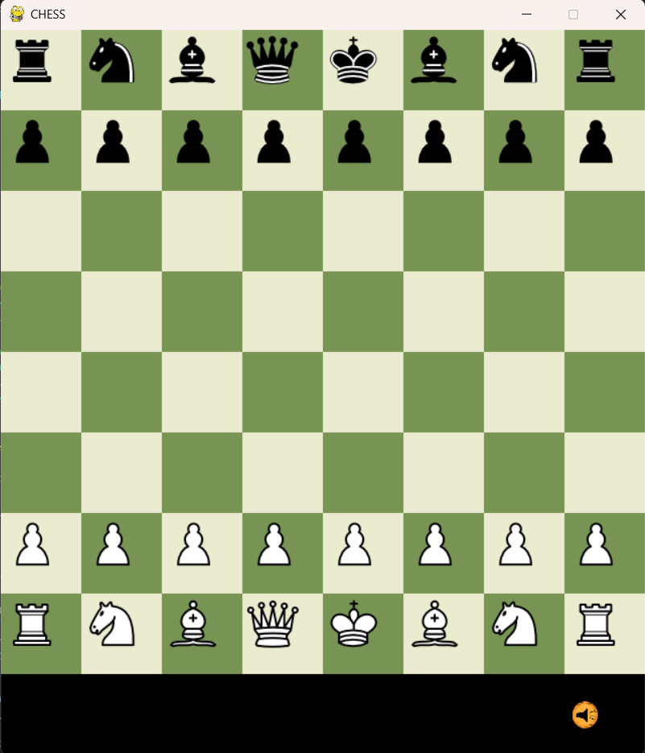

# ♟️ Python Chess Game

A fully functional chess game built using **Python** and **Pygame** — featuring smooth visuals, classic rule enforcement, and polished UI with sound and music.


---

## 🧩 Features

- ✅ Complete chess logic (all standard piece movements)
- ✅ Check and checkmate detection
- ✅ Pawn promotion (with captured piece selection)
- ✅ Turn-based system with move validation
- ✅ GUI highlighting for selected pieces and valid moves
- ✅ Image-based chess pieces and board
- ✅ Start menu with clickable **Start/Exit** buttons
- ✅ Background music with toggle (on/off)
- ✅ Button click sound effects
- ✅ Menu hover effect using image buttons
- ✅ Responsive user interface using `pygame`

---

## 🛠️ Tech Stack

| Tool     | Purpose               |
|----------|------------------------|
| Python 3.12 | Programming language |
| Pygame 2.6.1 | Game engine / GUI    |
| VS Code / Git | Development & version control |
| GitHub   | Project hosting        |

---

## 📂 Folder Structure

Chess_game/
├── assets/ # All images, sounds, music
├── main.py # Main game loop
├── board.py # Board & move handling
├── pieces.py # Piece classes and logic
├── constants.py # Game-wide constants
├── README.md # This file
└── .gitignore # Git exclusions


---

## ▶️ How to Run

1. Clone the repo:

```bash
git clone https://github.com/IndrajithGP/python-chess-game.git
cd python-chess-game
```


---

Install Dependencies : pip install pygame
And run the game : python main.py

---

## 🔊 Sound & Music
Background music toggled from the menu and in-game

Button sound effect on clicks

---

## 💡 Future Improvements

1. Add AI to play against the computer
2. Add timer / chess clock
3. Undo move
4. Polishing the GUI
5.Export to .exe

---

## 📸 Screenshots




---

## 🤝 Let's Connect!

Feel free to:

⭐ Star this repo

🧑‍💼 Connect with me on LinkedIn

📨 Suggest improvements or ideas!
